# Framework extension — concurrency, graceful shutdown & cloud deployment

> This section documents the extension built for the "Containerizing and Deploying a Java Web Application" workshop assignment. It does **not** use Spring — it extends the course's own minimal web framework (documented in full below, under "WebFramework").

## Current state of the framework

Before this extension, `HttpServer` was strictly **sequential**: it accepted one client connection at a time in a single-threaded `while` loop, and `stop()` only flipped a boolean flag without ever unblocking the blocking `accept()` call — so graceful shutdown didn't actually work end to end (the server would hang until the next incoming connection before it noticed it should stop).

## Changes introduced in this extension

- **Concurrent request handling:** each accepted connection is now dispatched to a virtual-thread executor (`Executors.newVirtualThreadPerTaskExecutor()`, Java 21) instead of being handled inline in the accept loop. Multiple clients are served in parallel; the accept loop itself stays single-threaded and just keeps dispatching.
- **Real graceful shutdown:** `stop()` now closes the `ServerSocket`, which unblocks the blocking `accept()` call with an `IOException` that the loop treats as an expected shutdown signal (rather than an error) when `running == false`. After the accept loop exits, the executor is shut down with `awaitTermination(10s)` so in-flight requests get a chance to finish before the JVM returns control to the caller — with a forced `shutdownNow()` fallback if that timeout is exceeded.
- **Port from environment variable:** already present in the base framework (`WebFramework.start()` reads `PORT`, default `8080`) — kept as-is, now also passed through to the Docker container via `-e PORT=...`.
- **Docker container:** new `Dockerfile` (Amazon Corretto 21 base image), building and running the plain `.jar` (no Spring, no external dependencies).
- **AWS EC2 deployment:** deployed and verified on an Amazon Linux 2023 EC2 instance (AWS Academy Learner Lab), same flow as the main workshop repository (Docker Engine installed via `yum`, image pulled from Docker Hub, container run with `--restart unless-stopped`).

Relevant commit: [`02078b5` — Implement concurrent request handling with virtual threads and fix graceful shutdown](https://github.com/KeySerna/webframework-extension/commit/02078b5)

## Build and run locally

```bash
mvn clean package
$env:PORT=8080          # PowerShell; use `export PORT=8080` on Linux/macOS
$env:APP_ENV="development"
java -jar target/webframework.jar
```

Verify:
```
http://localhost:8080/hello?name=Pedro
```

Graceful shutdown (only available when `APP_ENV=development`):
```
http://localhost:8080/shutdown
```
The server prints `Server stopped gracefully.` and the process exits cleanly.

## Run in Docker

```bash
docker build -t <dockerhub-user>/webframework-extension:1.0 .
docker run -d --name webframework-extension \
  -e PORT=8080 -e APP_ENV=production \
  -p 8090:8080 <dockerhub-user>/webframework-extension:1.0
```

Verify: `http://localhost:8090/hello?name=Docker`

`/shutdown` must return **404** here, since `APP_ENV=production` disables that route — confirming the environment-based configuration works the same way inside a container as it does locally.

**Docker Hub repository:** https://hub.docker.com/r/keyserna/webframework-extension

## Cloud deployment evidence

Deployed on an AWS EC2 instance (Amazon Linux 2023, AWS Academy Learner Lab):

```bash
docker pull keyserna/webframework-extension:1.0
docker run -d --name webframework-extension --restart unless-stopped \
  -e PORT=8080 -e APP_ENV=production \
  -p 8080:8080 keyserna/webframework-extension:1.0
```

Verified with:
```
http://<ec2-public-ip>:8080/hello?name=AWS
```
Response: `Hello AWS`

> Note: this is an AWS Academy Learner Lab instance — its public IP changes between lab sessions, so the address above may no longer respond by the time this is reviewed. Re-running the steps in this section on a fresh instance reproduces the same result.

## Evidencia de la extensión

### Prueba local (raw jar y Docker)

Respuesta del servidor corriendo con `java -jar` en local:

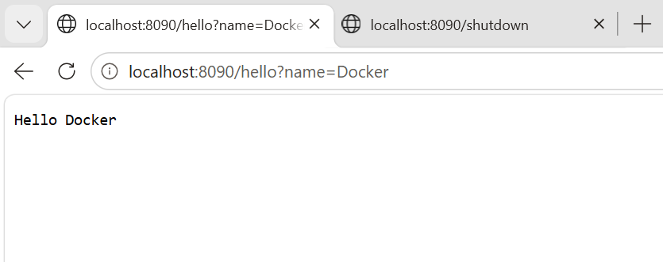

`/shutdown` devolviendo **404** cuando `APP_ENV=production` (confirma que la ruta de apagado grácil solo existe en desarrollo, tanto en local como dentro del contenedor):

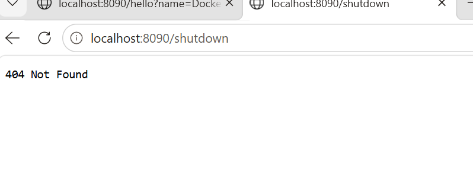

Imagen construida localmente con Docker Desktop, lista para publicar en Docker Hub:

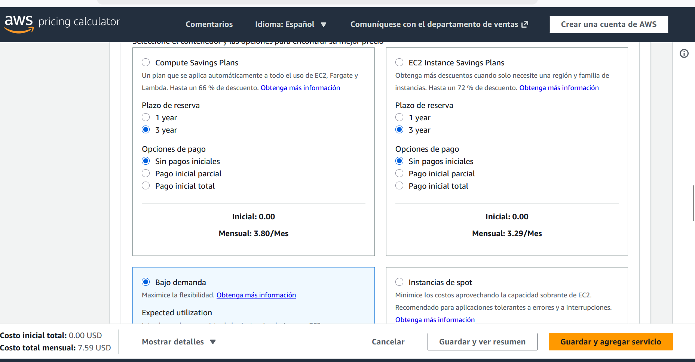

### Despliegue en AWS EC2

Instancia EC2 (Amazon Linux 2023) usando el par de claves `webframework-key`:

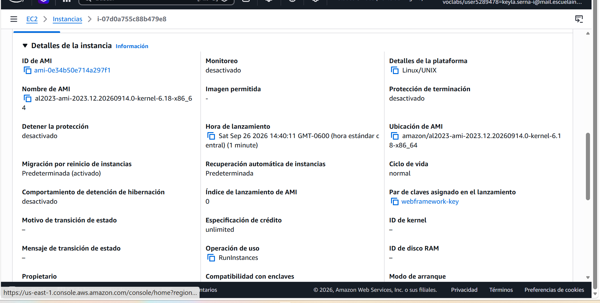

Reutilización del `.pem` de `virtualization-lab-key` para la instancia de reemplazo (tras perder acceso a la clave original de `webframework-key`, nunca descargada):

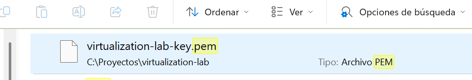

Conexión SSH exitosa a la instancia:

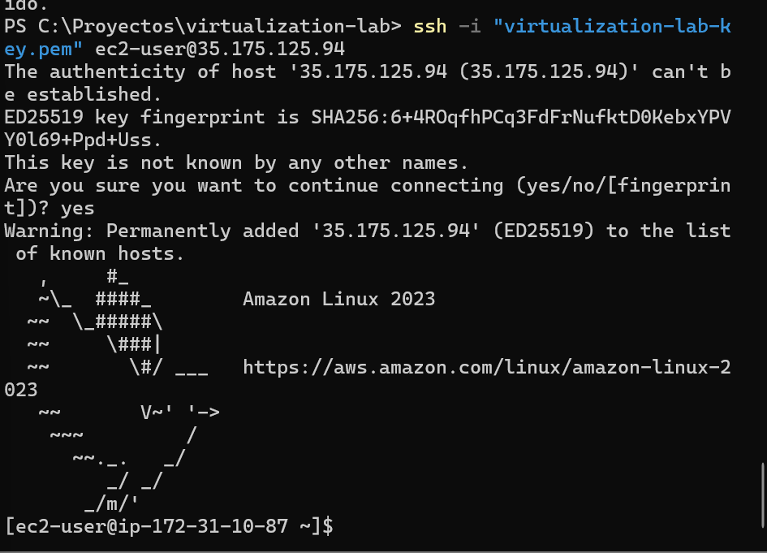

`docker pull`, `docker run`, `docker ps` y `docker logs` del contenedor en la instancia EC2:

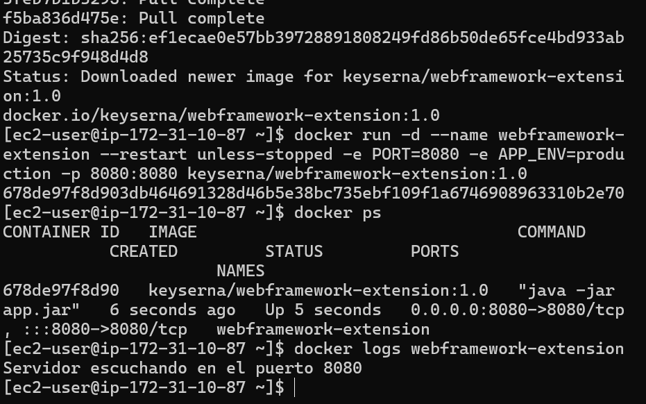

Respuesta pública `Hello AWS` desde la instancia:

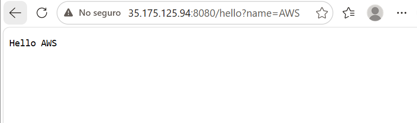

---

# Base framework documentation

Everything below this line documents the framework as it existed before this extension (concurrency + graceful shutdown fix + Docker + EC2), kept for reference.

# WebFramework

Mini framework web en Java (sin dependencias externas) que permite registrar servicios HTTP GET mediante funciones lambda, servir archivos estáticos y desplegarse en la nube con configuración externalizada. Desarrollado como parte del laboratorio *"Building and Deploying a Maintainable Application Server"*.

# Alumna: Keyla Yunuette Serna Illescas

## Descripción del proyecto

`WebFramework` evoluciona un servidor HTTP secuencial básico (que originalmente tenía las rutas dinámicas escritas a mano dentro del bucle de conexión) hacia un pequeño framework de aplicación reutilizable. Un desarrollador que use el framework puede registrar nuevas rutas GET con una lambda, sin tocar el código de manejo de sockets ni el ciclo de vida del servidor.

La aplicación de ejemplo (`Application.java`) sirve una página web con:

- Un formulario de saludo (`/hello?name=...`)
- El valor de π (`/pi`)
- El cálculo del cuadrado de un número (`/square?value=...`)
- Recursos estáticos: HTML, CSS, JavaScript y una imagen (logo)
- Una ruta de apagado grácil (`/shutdown`), disponible solo en desarrollo

## Arquitectura

```
Application
    Registra rutas y configuración (staticfiles, get, start)
        ↓
WebFramework (Framework API)
    Expone get(), staticfiles(), start(), stop()
        ↓
Router
    Asocia cada path con su lambda (Service) registrada
        ↓
HttpServer
    Acepta conexiones, parsea la petición HTTP y envía la respuesta
        ↓
Request / Response
    Representan los datos de la petición y la respuesta HTTP
        ↓
StaticFileService
    Sirve archivos desde el classpath cuando ninguna ruta dinámica coincide
```

Flujo de resolución de una petición:

```
Petición entrante
     ↓
Parsear método, path y query string
     ↓
¿Existe una ruta dinámica registrada para ese path?
     ├── Sí → ejecutar la lambda y devolver su resultado
     └── No → intentar servir un recurso estático
              ├── Existe → servirlo con el content-type correcto
              └── No existe → 404 Not Found
```

## Responsabilidades de los componentes

| Componente | Responsabilidad |
|---|---|
| `Application` | Define las rutas de negocio y arranca el servidor. Es la única clase que cambia cuando se agrega una funcionalidad nueva. |
| `WebFramework` | Punto de entrada público del framework (`get`, `staticfiles`, `start`, `stop`). Oculta los detalles de sockets al desarrollador. |
| `Router` | Guarda la lista de rutas registradas y busca cuál coincide con el path de una petición. |
| `Route` | Representa una ruta individual: un path y su `Service` (lambda) asociado. |
| `Service` | Interfaz funcional que define el contrato de un handler: `String handle(Request req, Response res)`. |
| `HttpServer` | Infraestructura HTTP: acepta conexiones, parsea la línea de petición, decide si delega al `Router` o al `StaticFileService`, y arma la respuesta. Contiene el ciclo de vida (arranque/apagado) del servidor. |
| `Request` | Expone el método, el path y los parámetros de query string (`getValue`). |
| `Response` | Permite a un handler definir el código de estado HTTP y el `Content-Type` de su respuesta. |
| `StaticFileService` | Busca y sirve archivos estáticos (HTML, CSS, JS, imágenes) desde el classpath, con el `Content-Type` correcto según la extensión. |

## Metáfora arquitectónica: el edificio de oficinas

Para explicar cómo encajan las piezas, pensemos en la aplicación como un **edificio de oficinas**:

| Elemento del edificio | Componente del framework |
|---|---|
| Entrada del edificio y recepcionista | `HttpServer`: recibe a cada visitante (conexión) y su solicitud |
| Directorio en el lobby | `Router`: le indica al visitante a qué oficina debe dirigirse según lo que pidió |
| Oficinas individuales | Las lambdas registradas con `get(...)`: cada una atiende un servicio específico (`/hello`, `/pi`, `/square`) |
| Archivo/bodega de documentos | `StaticFileService`: entrega documentos ya existentes (HTML, CSS, JS, imágenes) cuando el visitante no busca un servicio sino un archivo |
| Configuración del edificio | Las variables de entorno (`PORT`, `APP_ENV`, `GREETING_PREFIX`): definen en qué dirección/piso opera el edificio y bajo qué reglas, sin tener que remodelarlo (recompilar) |
| Procedimiento de cierre | El apagado grácil (`/shutdown` + `stop()`): el edificio termina de atender al visitante que ya está adentro antes de cerrar la puerta principal |

Esta metáfora refleja por qué el diseño es mantenible: cada "oficina" (lambda) se puede agregar o quitar sin reconstruir la recepción (`HttpServer`) ni el directorio (`Router`), y el archivo de documentos (`StaticFileService`) funciona de forma completamente independiente de los servicios dinámicos.

## Estructura del proyecto

```
src/main/java/
└── co/edu/escuelaing/
    ├── webframework/
    │   ├── HttpServer.java
    │   ├── WebFramework.java
    │   ├── Router.java
    │   ├── Route.java
    │   ├── Service.java
    │   ├── Request.java
    │   ├── Response.java
    │   └── StaticFileService.java
    └── app/
        └── Application.java

src/main/resources/
└── webroot/
    ├── index.html
    ├── app.js
    ├── styles.css
    └── images/
        └── logo.png
```

## Cómo compilar y ejecutar localmente

Requisitos: JDK 17+ y Maven.

```bash
git clone https://github.com/KeySerna/WebFramework.git
cd WebFramework
mvn clean package
java -cp target/classes co.edu.escuelaing.app.Application
```

Por defecto el servidor escucha en el puerto **8080** (no se define `PORT`). En consola debe aparecer:

```
Servidor escuchando en el puerto 8080
```

Luego abre en el navegador:

- `http://localhost:8080/` → página principal (HTML + CSS + JS + logo)
- `http://localhost:8080/hello?name=Pedro` → `Hello Pedro`
- `http://localhost:8080/pi` → valor de π
- `http://localhost:8080/square?value=4` → `El cuadrado de 4.0 es 16.0`
- `http://localhost:8080/no-existe` → `404 Not Found`

### Ejecutar con variables de entorno personalizadas (PowerShell)

```powershell
$env:PORT="9090"
$env:GREETING_PREFIX="Hola desde"
$env:APP_ENV="development"
java -cp target\classes co.edu.escuelaing.app.Application
```

En `development`, la ruta `/shutdown` queda habilitada:

```
http://localhost:9090/shutdown
```

Al visitarla, el servidor responde `"Server will stop after this response."`, cierra la conexión y termina el proceso mostrando `Server stopped gracefully.` en consola.

## Variables de entorno

| Variable | Propósito | Valor por defecto local |
|---|---|---|
| `PORT` | Puerto en el que escucha el servidor HTTP | `8080` |
| `GREETING_PREFIX` | Prefijo usado por la ruta `/hello` | `Hello` |
| `APP_ENV` | Entorno de ejecución; controla si `/shutdown` está habilitado (`development`) o deshabilitado (cualquier otro valor, p. ej. `production`) | `development` |

No se manejan credenciales ni tokens; ninguna variable sensible se commitea al repositorio.

## Despliegue en la nube (AWS EC2)

1. Lanzar una instancia EC2 (Amazon Linux 2023) desde AWS Academy Learner Lab.
2. En el Security Group de la instancia, abrir el puerto que usará la app (por ejemplo `8080`) a entrada desde `0.0.0.0/0`.
3. Conectarse por SSH a la instancia.
4. Instalar Java, Git y Maven (Amazon Linux 2023 trae `dnf`):
   ```bash
   sudo dnf install -y java-17-amazon-corretto git maven
   ```
5. Verificar que quedaron instalados: `java -version`, `git --version`, `mvn -version`.
6. Clonar el repositorio (mismo código fuente que en local):
   ```bash
   git clone https://github.com/KeySerna/WebFramework.git
   cd WebFramework
   mvn clean package
   ```
7. Configurar las variables de entorno de producción y arrancar el servidor en segundo plano:
   ```bash
   export PORT=8080
   export APP_ENV=production
   export GREETING_PREFIX="Hello from AWS"
   nohup java -cp target/classes co.edu.escuelaing.app.Application > server.log 2>&1 &
   ```
8. Verificar desde el navegador usando la IP pública de la instancia:
   - `http://<IP_PUBLICA>:8080/`
   - `http://<IP_PUBLICA>:8080/hello?name=Keysi`
   - `http://<IP_PUBLICA>:8080/pi`
9. Confirmar que `/shutdown` **no** está disponible en producción (debe responder `404 Not Found`), ya que `APP_ENV=production`.
10. Al finalizar la evaluación, limpiar los recursos de AWS (terminar la instancia).

**Plataforma usada:** AWS EC2 (AWS Academy Learner Lab), instancia Amazon Linux 2023.

**URL pública de despliegue:** `http://107.22.113.163:8080/`

> Nota: esta IP pública pertenece a una instancia temporal de AWS Academy Learner Lab y cambia cada vez que se reinicia el laboratorio. Si el enlace ya no responde al momento de revisar la entrega, vuelve a seguir los pasos de esta sección para levantar una nueva instancia.

### URLs de ejemplo

| Recurso | URL |
|---|---|
| Página principal | `http://107.22.113.163:8080/` |
| Recurso estático (JS) | `http://107.22.113.163:8080/app.js` |
| Recurso estático (imagen) | `http://107.22.113.163:8080/images/logo.png` |
| Endpoint REST 1 | `http://107.22.113.163:8080/hello?name=Keysi` |
| Endpoint REST 2 | `http://107.22.113.163:8080/pi` |
| Endpoint REST 3 | `http://107.22.113.163:8080/square?value=5` |

## Pruebas realizadas

- `GET /hello?name=Pedro` → `Hello Pedro` (200 OK)
- `GET /hello` (sin parámetro) → `Hello world` (no falla, usa el valor por defecto)
- `GET /pi` → valor de π (200 OK)
- `GET /square?value=4` → `El cuadrado de 4.0 es 16.0` (200 OK)
- `GET /square` (sin parámetro) → 400 Bad Request, mensaje de error controlado
- `GET /square?value=abc` → 400 Bad Request, mensaje de error controlado
- `GET /index.html`, `/app.js`, `/styles.css`, `/images/logo.png` → 200 OK con el `Content-Type` correcto
- `GET /no-existe` → 404 Not Found
- `GET /shutdown` con `APP_ENV=development` → detiene el servidor de forma grácil (procesa la respuesta antes de cerrar)
- `GET /shutdown` con `APP_ENV=production` → 404 Not Found (ruta no registrada)

## Evidencia del despliegue en la nube

**Página principal cargando desde la IP pública de EC2:**

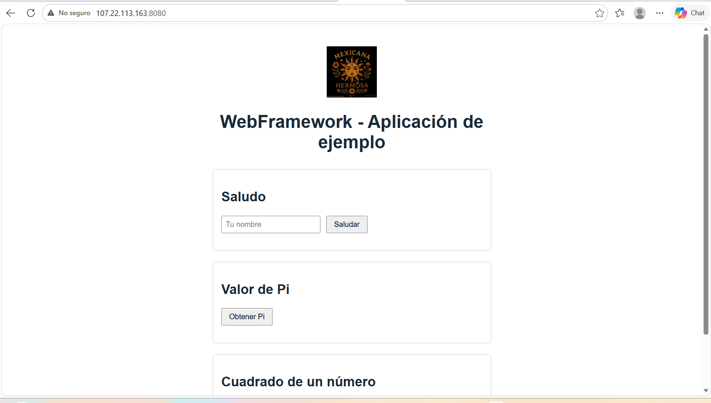

**Endpoint REST `/hello` respondiendo en producción:**

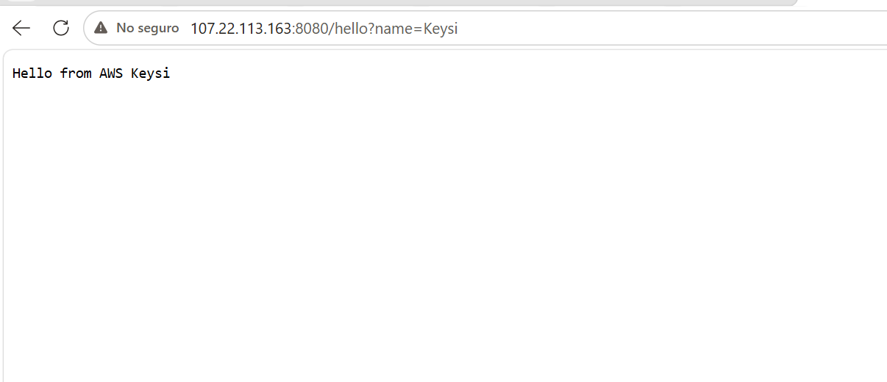

**Endpoint REST `/pi` respondiendo en producción:**

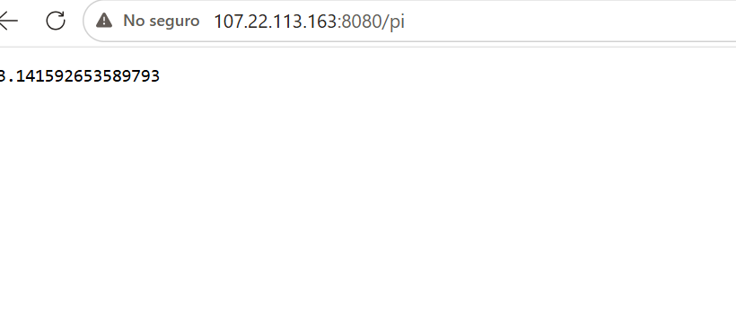

**Variables de entorno configuradas en la instancia (sin exponer nada sensible):**

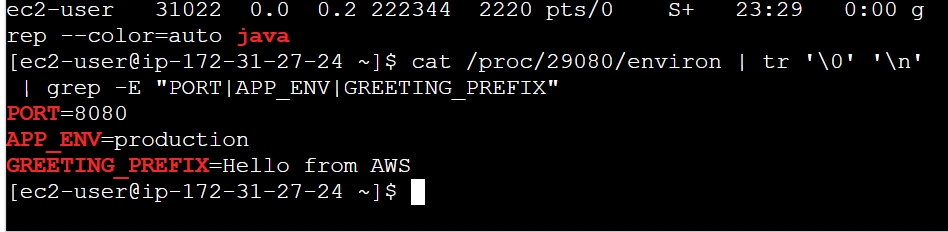

**`/shutdown` deshabilitado en producción (`APP_ENV=production` → 404 Not Found):**

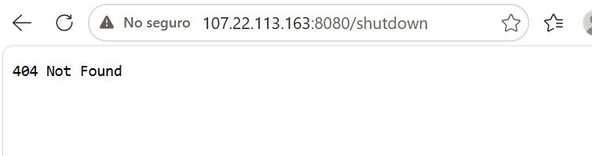

**`/shutdown` funcionando en local con `APP_ENV=development` (apagado grácil):**

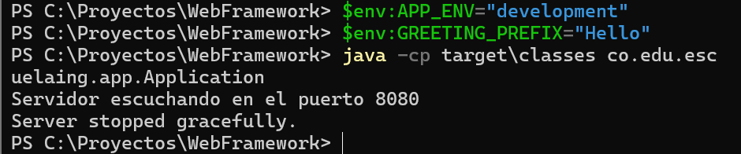

## ¿Por qué esta arquitectura es mantenible?

La mantenibilidad no viene simplemente de usar lambdas, sino de separar lo que cambia frecuentemente (las rutas de negocio) de lo que permanece estable (el manejo de sockets y HTTP). Agregar un nuevo servicio solo requiere una llamada a `get(...)` en `Application`, sin tocar `HttpServer` ni `Router`. Cada componente tiene una única responsabilidad (parseo HTTP, enrutamiento, archivos estáticos, lógica de negocio), lo que permite probarlos por separado y entender el sistema pieza por pieza. La configuración específica del entorno (puerto, prefijo de saludo, modo de ejecución) vive fuera del código fuente, en variables de entorno, por lo que el mismo artefacto compilado corre igual en una máquina local que en la nube, sin recompilar ni modificar código para cada entorno.
